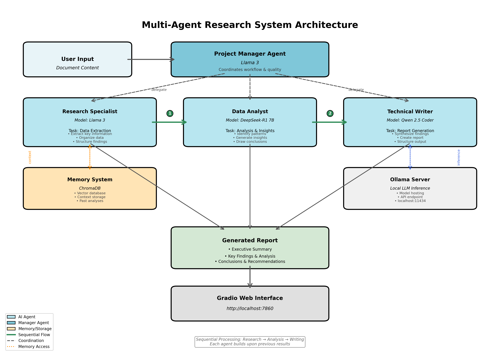

# Multi-Agent Research System

An intelligent document analysis system powered by multiple specialized AI agents working collaboratively to generate comprehensive research reports.



## Overview

This system leverages CrewAI to orchestrate multiple specialized AI agents, each powered by different Ollama models, to analyze documents and generate professional research reports. The agents work together in a coordinated workflow, combining their unique strengths to produce high-quality insights.

## Architecture

### Multi-Agent System

The system employs 4 specialized agents:

| Agent | Model | Role | Responsibility |
|-------|-------|------|----------------|
| Research Specialist | Llama 3 | Data Extraction | Extracts and organizes key information, facts, and data points |
| Data Analyst | DeepSeek-R1 7B | Analysis & Insights | Identifies patterns, trends, and generates meaningful insights |
| Technical Writer | Qwen 2.5 Coder | Report Generation | Synthesizes findings into clear, professional reports |
| Project Manager | Llama 3 | Coordination | Orchestrates workflow and ensures quality standards |

### Technology Stack

- Framework: CrewAI (multi-agent orchestration)
- LLM Provider: Ollama (local inference)
- Models: Llama 3, DeepSeek-R1 7B, Qwen 2.5 Coder
- Memory: ChromaDB (vector database for persistent context)
- UI: Gradio (web interface)
- Language: Python 3.10+

## Features

- Multi-Agent Collaboration: Four specialized agents working together
- Persistent Memory: ChromaDB stores context across sessions
- Flexible Processing: Sequential or concurrent task execution
- Report Management: Automatic timestamped report saving
- Web Interface: Clean, intuitive Gradio UI
- Fully Local: All processing happens on your machine
- Zero API Costs: No external API calls required

## Quick Start

### Prerequisites

- Python 3.10 or higher
- Ollama installed and running (https://ollama.ai/download)

### Installation

1. Clone the repository
```bash
git clone https://github.com/yourusername/multi-agent-research-system.git
cd multi-agent-research-system
```

2. Install Python dependencies
```bash
pip install -r requirements.txt
```

3. Install Ollama models
```bash
ollama pull llama3
ollama pull deepseek-r1:7b
ollama pull qwen2.5-coder
```

4. Start Ollama server (in separate terminal)
```bash
ollama serve
```

5. Run the application
```bash
python src/enhanced_app.py
```

6. Open browser to http://localhost:7860

## Usage

### Basic Usage

1. Start the application: `python src/enhanced_app.py`
2. Paste your document content into the text area
3. Configure options:
   - Enable Memory: Keep context across sessions
   - Concurrent Processing: Faster but less integrated
4. Click "Analyze Document"
5. Wait 2-5 minutes for comprehensive report
6. View results in the UI or check `src/output/latest_report.txt`

### Configuration Options

#### Memory (ChromaDB)

When enabled:
- System remembers previous analyses
- Provides context-aware insights
- Builds knowledge over time

When disabled:
- Each analysis is independent
- No historical context used
- Faster initialization

#### Processing Mode

Sequential (Recommended):
- Research → Analysis → Writing (in order)
- Better integration between agents
- More coherent final output

Concurrent:
- All agents work in parallel
- Faster completion time
- Less integrated results

## Project Structure

```
multi-agent-research-system/
├── README.md                           # Project documentation
├── requirements.txt                    # Python dependencies
├── .gitignore                          # Git ignore rules
├── multi_agent_architecture.png        # Architecture diagram
│
├── report/                             # Sample documents
│   ├── sample_ai_trends.txt
│   ├── sample_business_report.txt
│   └── sample_technical_paper.txt
│
└── src/                                # Source code
    ├── enhanced_multi_agent_system.py  # Core multi-agent system
    ├── enhanced_app.py                 # Gradio web interface
    │
    ├── memory_db/                      # ChromaDB storage
    │   └── chroma.sqlite3
    │
    └── output/                         # Generated reports
        ├── latest_report.txt
        └── report_YYYYMMDD_HHMMSS.txt
```

## How It Works

### Agent Workflow

1. Research Specialist (Llama 3)
   - Reads input document
   - Extracts key information and facts
   - Organizes data into structured format

2. Data Analyst (DeepSeek-R1 7B)
   - Receives research findings
   - Identifies patterns and trends
   - Generates insights and implications

3. Technical Writer (Qwen 2.5 Coder)
   - Receives research and analysis
   - Creates comprehensive report
   - Structures with executive summary, findings, conclusions

4. Project Manager (Llama 3)
   - Coordinates all agents
   - Ensures quality standards
   - Manages task delegation

### Memory System

The system uses ChromaDB to maintain context:

- Vector embeddings of previous reports
- Semantic search for relevant past analyses
- Automatic context retrieval for similar topics
- Persistent storage across sessions

### Report Generation

Each analysis produces:
- Timestamped report file: `report_YYYYMMDD_HHMMSS.txt`
- Latest report: `latest_report.txt`
- Saved to: `src/output/`

## Example Use Cases

### Business Intelligence
- Analyze market research reports
- Synthesize competitive analysis
- Generate executive summaries

### Research & Academia
- Literature review synthesis
- Research paper analysis
- Technical documentation review

### Content Analysis
- News article analysis
- Policy document review
- Technical specification analysis

## Technical Details

### Model Selection

- Llama 3: General-purpose, excellent for research and coordination
- DeepSeek-R1 7B: Specialized in reasoning and analysis
- Qwen 2.5 Coder: Technical writing and structured output

### Performance

- Analysis time: 2-5 minutes per document
- Memory usage: ~4-8 GB RAM
- Disk space: ~15-20 GB (models + database)

### Requirements

Minimum:
- CPU: 4 cores
- RAM: 8 GB
- Disk: 20 GB free space

Recommended:
- CPU: 8+ cores
- RAM: 16+ GB
- Disk: 50+ GB free space

## Troubleshooting

### Common Issues

**"Model not found" error:**
```bash
# Ensure Ollama is running
ollama serve

# Verify models are installed
ollama list

# Pull missing models
ollama pull llama3
ollama pull deepseek-r1:7b
ollama pull qwen2.5-coder
```

**"Connection refused" error:**
- Start Ollama server: `ollama serve`
- Keep terminal open while app runs

**Slow performance:**
- Close other applications
- Use sequential processing
- Reduce document size

**Empty reports:**
- Check `src/output/latest_report.txt` directly
- Clear cache: `rm -rf src/__pycache__`
- Restart application

### Getting Help

- Check logs in terminal
- Review `src/output/` for reports
- Ensure Ollama server is running
- Verify all models are installed

## Development

### Adding New Agents

Edit `src/enhanced_multi_agent_system.py`:

```python
def _create_custom_agent(self):
    return Agent(
        role='Custom Role',
        goal='Specific goal',
        backstory='Agent background',
        llm=self.model_name,
        verbose=True
    )
```

### Changing Models

Edit model initialization in `enhanced_multi_agent_system.py`:

```python
self.custom_model = LLM(
    model="ollama/your-model-name",
    base_url="http://localhost:11434"
)
```

### Custom Processing

Modify task definitions in `analyze()` method to customize workflow.

## Performance Optimization

### Tips for Faster Analysis

1. Use sequential processing (more efficient)
2. Disable memory for simple queries
3. Keep document size under 5000 words
4. Close unnecessary applications
5. Use SSD for database storage

### Memory Management

Clear old reports:
```bash
rm src/output/report_*.txt
```

Clear memory database:
```bash
rm -rf src/memory_db/
```


Built with CrewAI, Ollama, and Python
